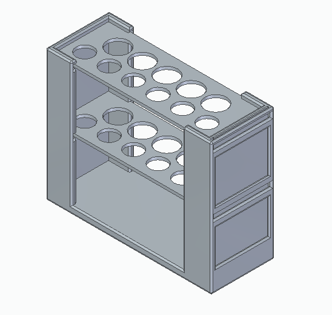
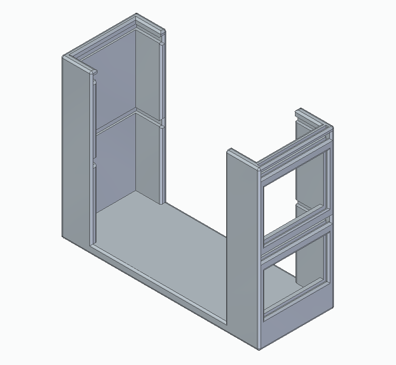
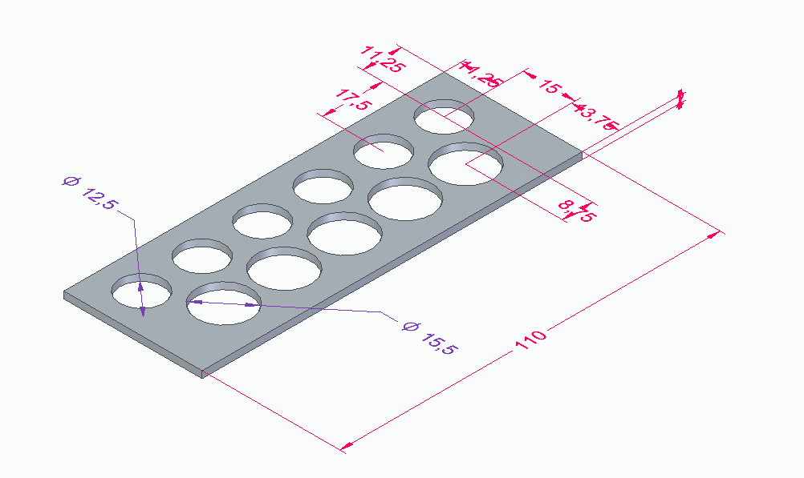
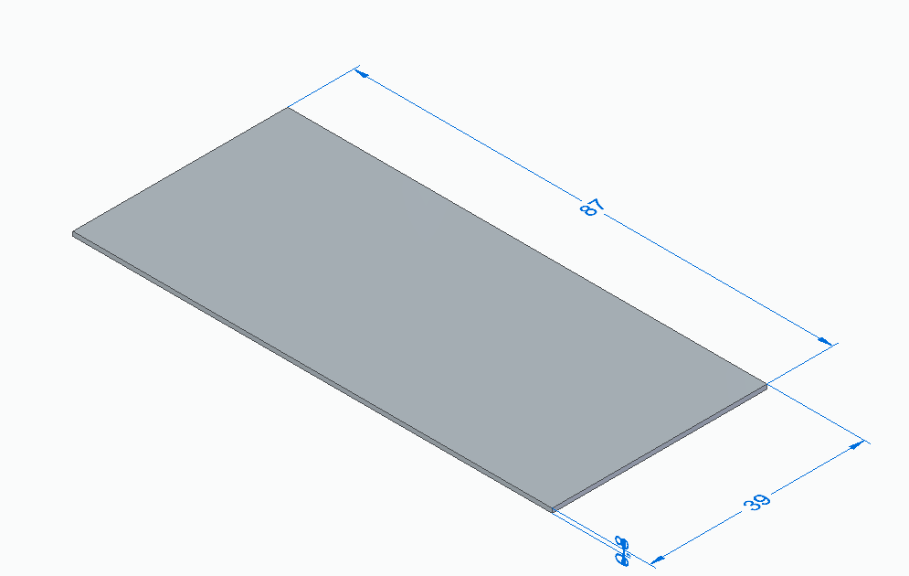

# BloodSampleRack

## Notes
This project is done for a friend who is a veterinarian and asked for a 
blood sample rack for the samples he collects for his Ph.D. (I am writing this to make the project less weird)

Either the outside of the rack or the blockplate have additional space for some decorations.

## Assembly
The rack consists of four components
- rack
- plate (2x)
- blockplate

After printing the parts some adjustments using a file to get rid of uncertainties of the printer.
Finally, the rack can be assembled by inserting the plates into the rack and blocking their movement
with the blockplate. This is also illustrated in the following image

")

## Images

